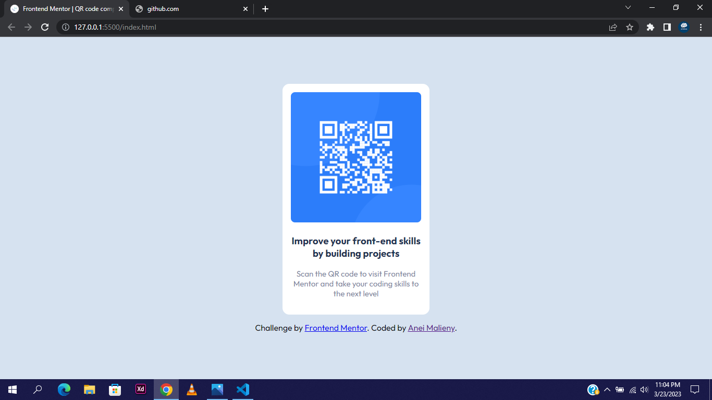

# qr-code-component-main
Frontend Mentor qr-code-component-main challenge.
# Frontend Mentor - QR code component solution

This is a solution to the [QR code component challenge on Frontend Mentor](https://www.frontendmentor.io/challenges/qr-code-component-iux_sIO_H). Frontend Mentor challenges help you improve your coding skills by building realistic projects. 

## Table of contents

- [Overview](#overview)
  - [Screenshot](#screenshot)
  - [Links](#links)
- [My process](#my-process)
  - [Built with](#built-with)
  - [What I learned](#what-i-learned)
  - [Continued development](#continued-development)
  - [Useful resources](#useful-resources)
- [Author](#author)
- [Acknowledgments](#acknowledgments)

**Note: Delete this note and update the table of contents based on what sections you keep.**

## Overview

### Screenshot




### Links

- Solution URL:[Click Here](https://your-solution-url.com](https://www.frontendmentor.io/solutions/css-flexbox-with-html-ZfEOGkqokN)
- Live Site URL:[Click Here](https://your-live-site-url.com](https://aneiqrcodefrontendmentor.netlify.app/)

## My process

### Built with

- Semantic HTML5 markup
- CSS custom properties
- Flexbox
- Web-first workflow


### What I learned

I've learnt how to centre a div with margins.
I'm also learning how to use my eye to judge the margins, padding and font-size of the design.

Here is how you can centre a div using margins, Please note the css property must always have a width assigned to it otherwise it won't work.
```HTML
<div class="container">
    <h3>Improve your front-end skills by building projects</h3>
    <p>Scan the QR code to visit Frontend Mentor and take your coding skills to the next level</p>
</div>
```
```css
.container{
  width: 250px;
  margin: 0 auto;
}
```
This leaves you with all your work centre. NOTE: This only works with display: block; however much i didnt add it because by default display is block.


### Continued development

I'd love to learn more about Flexbox and Grid. Then alot of other css properties.

### Useful resources

- [Google Fonts](https://www.googlefonts.com) - This helped me with getting the font off the internet.

## Author

- Website - [Anei Malieny](https://www.twitter.com/sickomody)
- Frontend Mentor - [@aneimalieny](https://www.frontendmentor.io/profile/aneimalieny)
- Twitter - [@yourusername](https://www.twitter.com/sickomody)

## Acknowledgments

This was a solo-project that I kept procastinating for a while but i finally did it. Thanks!
